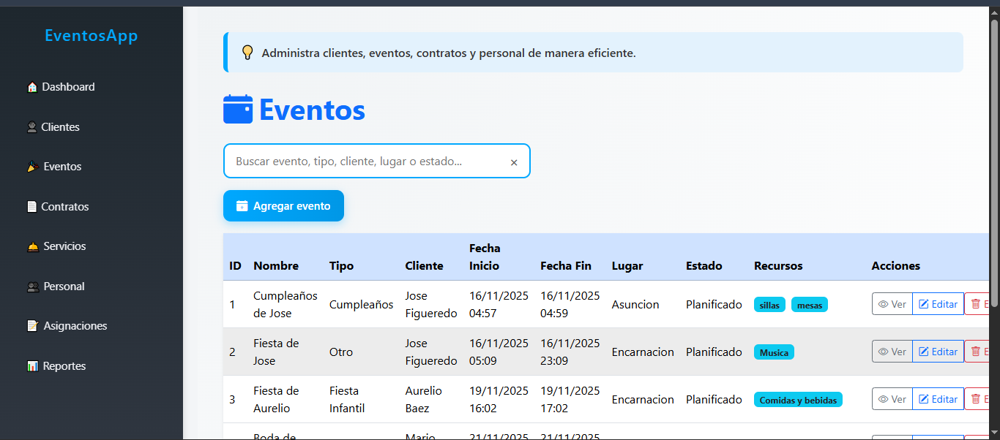
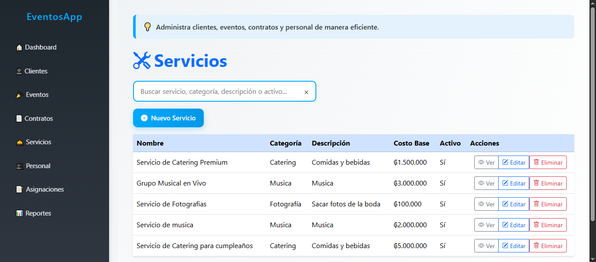

# Gestión de Eventos

Aplicación desarrollada en Ruby para la gestión de eventos.

## 🚀 Funcionalidades
- Registro de eventos
- Gestión de usuarios
- CRUD completo

## 🛠️ Tecnologías
- Ruby
- HTML / CSS
- PostgreSQL

## 📸 Capturas de pantalla





## ▶️ Ejecución
```bash
ruby main.rb
